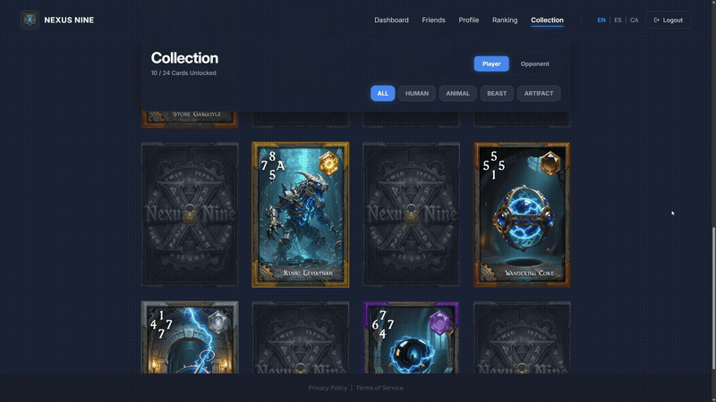

# 42 Common Core Portfolio

  
  
  

---

## 🚀 About Me & The Portfolio

Welcome! This repository is a curated showcase of my software engineering journey through the **42 Barcelona Common Core** curriculum. 

As a developer passionate about low-level systems, architecture, and high-performance applications, I have utilized this intensive program to master memory management, custom algorithm design, and full-stack integration. Here you will find my complete codebase, demonstrating solid engineering practices, rigorous styling standards, and clean, modular code.

### 🛠️ Core Technologies

  
  
  
  
  
  
  
  

---

## 🏫 What is the 42 Common Core?

The **Common Core** is the highly intensive core curriculum of the 42 Network. Operating without professors, formal lectures, or traditional classrooms, it forces students to become entirely self-reliant. 

We learn by tackling complex engineering problems, reading official RFC documentations, and collaborating directly with peers. Every single line of code in this repository was written, tested, and audited manually.

### ⚠️ Uncompromising Standards & Rigor

To pass any project, the codebase must survive an automated evaluation system alongside multiple strict peer-to-peer code reviews. The constraints are unforgiving:

* **No Standard Libraries:** For most of the curriculum, we are strictly forbidden from using external libraries or even basic standard functions (e.g., no `printf`, `memcpy`, or `get_next_line` from the OS). We had to code our own standard C library (`libft`), our own I/O multiplexing systems, and our own algorithms from scratch.
* **Flawless Memory Management:** Manual memory allocation is mandatory in C. Any project with a single byte of leaked memory or a segmentation fault receives an immediate score of **0**. All projects are audited with `Valgrind` and `leaks`.
* **The "Norminette" Style Guide:** Code must adhere to a strict styling standard. Functions are limited to a maximum of 25 lines, files to 5 functions, no global variables are allowed, and variable declarations are tightly restricted. This builds incredibly disciplined, clean, and highly readable codebases.
* **100% Perfect Score Record:** Every project in this repository has been successfully completed with the maximum possible grade. This means achieving **125/100** (fully functional core + 100% of advanced bonus features) or **100/100** on projects where bonus phases were not applicable.

---

## 🏆 Featured Projects

This section highlights the three most complex and multidisciplinary engineering challenges I solved during my time at 42. These projects demonstrate system design, high-performance graphics, real-time networking, and full-stack architecture.

---

### 1. 🃏 ft_transcendence — The Ultimate Web & Game Integration

<table align="center">
  <tr>
    <td align="center" width="50%">
      <b>Dynamic Web Dashboard & Collection</b> 
      
    </td>
    <td align="center" width="50%">
      <b>Real-Time Unity WebGL Gameplay (PLUS! Match)</b> 
      
    </td>
  </tr>
</table>

#### 📊 Project Specification & Performance
*   **Grade:**  *(Full validation + Advanced bonus)*
*   **Tech Stack:**
            
*   **My Role (Systems Architect & Lead Game Developer):** 
    *   **Lead Game Developer:** Designed, built, and optimized the entire Unity WebGL online card-game client from scratch, managing the local game loop, asset rendering, and events.
    *   **Backend & Systems Architect:** Designed and developed the core server architecture in Laravel, including the authoritative game logic, real-time matchmaking, the relational database, and secure API gateways.
    *   **Full-Stack Integrator:** Engineered the real-time communication bridges and synchronized states across React, Laravel's socket layer, and Unity WebGL.

#### 🧠 Key Engineering Challenges Solved

*   **Authoritative Game Server & Recursive Rule Engine:** 
    To guarantee game state integrity and prevent client-side manipulation, I implemented an authoritative game server model in Laravel. The backend acts as the single "Source of Truth" (`active_matches` schema). When a player plays a card (`POST /play-card`), the server validates the move, processes the core card-flip mathematics, resolves advanced **"Same" (Igual)** and **"Plus" (Suma)** rules, and calculates the resulting cascading flip chains before pushing the resolved state back to the clients.
*   **Dynamic Database Architecture & Match History:** 
    I designed and normalized a comprehensive relational database schema (MariaDB). It segregates operations into high-performance structures for active match tracking (handling volatile states such as active gameplay data) and persistent structures for long-term storage (such as match histories, achievements, and localized translations). This architecture ensures rapid matchmaking queues and optimizes execution times for leaderboard queries.
*   **Event-Driven Synchronization & Low-Latency Sockets:** 
    Using Laravel Reverb and Redis as the broadcast driver, I developed a low-latency pipeline to synchronize matches. To prevent race conditions, Unity does not execute visual states based on REST responses; instead, it remains entirely event-driven, waiting for the global `match.card_played` WebSocket broadcast. This ensures both players witness board updates and flip animations in perfect, real-time synchronization.
*   **Millisecond-Accurate Sync (NetworkTimeProvider):** 
    Turn-based competitive games require strict timeout validations. I engineered a `NetworkTimeProvider` inside Unity that calculates network offset/latency during the initial REST handshake and via WebSocket heartbeats (`match.pong`). This synchronizes both clients with the server's master clock down to the millisecond, driving precise UI countdowns and securing server-side turn expirations.
*   **Double-Ready Handshake & Watchdog Turn-Buffering:** 
    To support fair play across varied hardware and networking setups, I implemented a "Double-Ready" barrier (`POST /loading-ready`). The game only transitions to the drafting phase once both assets are loaded. Additionally, a server-side timer watchdog calculates an animation-delay buffer before launching the next player’s 30-second turn timer, preventing players with high latency from losing active play time.

> [!NOTE]
> **Security, Integrity & Edge Cases** 
> Beyond core gameplay, I implemented multiple security layers to protect session state, including strict matchmaking queue penalties for "rage-quits" or sudden disconnections, idempotent validations on deck confirmations to prevent duplicate packet injection, and rigorous API request auditing. 
> 
> 🔗 *[Read the complete Technical & Socket Contract Documentation here](./transcendence/README.md)*

---

### 2. 🐚 minishell — As Close to the Kernel as It Gets
<!-- MINISHELL CARD PLACEHOLDER -->

  <!-- When available, replace with your custom GIF/screenshot:  -->
  

#### 📊 Project Specification & Performance
*   **Grade:**  *(Full validation + Advanced bonus)*
*   **Tech Stack:**
       
*   **My Role (Systems & Algorithms Developer):**
    *   **Core Parser & Lexer Architect:** Designed the state machine responsible for tokenizing raw user input, handling nested quotes, environment variables, and building an abstract execution tree.
    *   **Process Control Engineer:** Managed the lifecycle of multiple concurrent processes, file descriptor redirections, and Unix signal handling.
    *   **Bonus Features Developer:** Engineered the recursive subprocess engine for logical grouping, conditional operators, and the directory wildcard expansion algorithm.

#### 🧠 Key Engineering Challenges Solved

*   **Recursive Execution Engine for Parentheses & Logical Operators:**
    To implement nested command grouping and conditional logic (e.g., `(cat file && ls) || echo "failed"`), I designed a recursive execution engine. When the parser detects parenthesis blocks or logical operators (`&&` and `||`), the shell isolates execution into dedicated subshell processes. These processes recursively evaluate the inner commands and propagate the precise exit status of each instruction to solve complex boolean command chains.
*   **Authoritative Process Lifecycle & I/O Multiplexing:**
    Handling complex multi-pipeline streams (`cmd1 | cmd2 | cmd3`) required managing file descriptors with absolute precision. I implemented robust pipeline execution using `pipe()` and bidirectional redirections with `dup2()`. By carefully tracking and closing unused write/read ends in both parent and child contexts, I prevented hanging inputs and file descriptor leaks.
*   **Unix Signal Handling & Volatile State Restoration:**
    A major challenge in shells is maintaining an interactive prompt that gracefully reacts to user signals. I configured terminal attributes and implemented custom handlers for `SIGINT` (Ctrl+C), `SIGQUIT` (Ctrl+\), and `EOF` (Ctrl+D). This ensures that background processes terminate cleanly while the main shell prompt is immediately repainted without losing the shell's volatile environmental state.
*   **Dynamic Wildcard (*) Expansion:**
    I implemented path-pattern matching (Wildcards) from scratch. The algorithm scans active directories, evaluates system structures, and dynamically replaces the wildcard token `*` with sorted, matching file paths before executing the command, mirroring native Bash expansion.

> [!NOTE]
> **Strict Memory Management & Rigor** 
> Operating at the systems level in C, this project enforces strict memory tracking. Any dynamic allocation (`malloc`) is monitored to prevent memory leaks. The entire codebase is audited with Valgrind and compiler flags to ensure total stability, flawless garbage collection on execution failure, and absolute safety.
> 
> 🔗 *[Explore the complete Lexer & Parser implementation here](./minishell/README.md)*

---

### 3. 🎮 cub3D — Raycasting Graphics Engine from Scratch
<!-- CUB3D CARD PLACEHOLDER -->

  <!-- When available, replace with your custom GIF/screenshot:  -->
  

#### 📊 Project Specification & Performance
*   **Grade:**  *(Full validation + Advanced bonus)*
*   **Tech Stack:**
       
*   **My Role (Graphics & Systems Developer):**
    *   **Core Renderer Architect:** Programmed the 3D projection mathematical system, utilizing DDA (Digital Differential Analysis) algorithms to cast rays, calculate wall slice heights, and render textures.
    *   **Gameplay & Logic Developer:** Created a multi-level state machine, portal transition mechanics, player-to-world collision mapping, and score tracking.
    *   **Visual & Audio Engineer:** Implemented time-based sprite animations, a software-calculated distance shading engine, and integrated the BASS audio library for synchronized soundscapes.

#### 🧠 Key Engineering Challenges Solved

*   **Conceptual Level Design & Dynamic Map Linker:**
    I designed an infinite-level chaining system driven by custom `.cub` map configuration files. Rather than hardcoding transitions, I expanded the parser to read a dynamic `NEXT_MAP` attribute. When the player steps into a portal, the engine hot-unloads the current memory structures, validates the new file, and seamlessly initialises the next zone, terminating the loop only when a map lacks the parameter. Using this architecture, we built a thematic campaign based on **Vivaldi's Four Seasons**, where each of the 4 maps visually represented a season.
*   **Horizontal Plane Texturing & Dynamic Depth Shading:**
    While vertical walls only require 1D texture mapping, rendering textured floors and ceilings demands complex 2D plane projections. I formulated mathematical translation layers to map horizontal textures (like grass and starry skies) relative to the player's spatial angle. Additionally, I built a software-based depth shading system. The engine calculates the distance of every single ray collision, blending the RGB channels of wall, floor, and ceiling textures toward black to achieve an atmospheric fade-to-darkness effect.
*   **2D Layer Blitting (Dynamic Minimap & HUD Overlay):**
    To provide spatial awareness and progression tracking, I implemented a custom render overlay. The engine draws a dynamic 2D minimap in the top-right corner, translating the map's grid layout and the player's viewing vector into a real-time vector representation. Above the viewport, I designed a retro HUD that parses and blits custom alphanumeric assets and status icons directly onto the MinilibX frame buffer, tracking levels, keys, and collected items.
*   **Multi-Threaded Audio Integration (BASS Library) & Chiptune Soundscapes:**
    To support our thematic design, I integrated the **BASS audio library** to handle concurrent background music and sound effects. The engine dynamically plays 8-bit chiptune arrangements of Vivaldi's seasonal compositions tailored to each map. Additionally, I built an event-triggered sound system to play specific FX upon opening sliding doors, collecting floating coins, or stepping through portals, managing memory safely to prevent audio-buffer overflows in C.
*   **Procedural Sliding Doors & Animated Sprite Sorting:**
    I implemented Wolfenstein 3D-style sliding doors as an interactive bonus. Unlike static walls, doors require the raycaster to detect dynamic boundaries and compute fractional offsets. When activated, the engine updates the door's state frame-by-frame, shifting the texture coordinates horizontally. Concurrently, 3D world elements (like floating keys and coins) are dynamically rendered as 2D billboard sprites, automatically sorted by distance to prevent visual depth clipping.

> [!NOTE]
> **Performance Tuning & Math Optimization** 
> Operating at the systems level in C, this project enforces strict memory tracking. Any dynamic allocation (`malloc`) is monitored to prevent memory leaks. To achieve a stable and smooth rendering loop at native retro resolutions, the engine corrects the "fisheye" distortion using angle-offset cosine scaling and performs direct pixel manipulation on the MinilibX image buffer before pushing the frames to the screen.
> 
> 🔗 *[Explore the mathematical raycasting and rendering implementation here](./cub3d/README.md)*

---

## 📊 Other Cursus Projects

Below is the complete index of the other fundamental projects I developed throughout the Common Core, showcasing consistent performance and deep dive into low-level computing.

| Project / Repository | Grade / Performance | Tech Stack | Core Focus & Engineering Architecture |
| :--- | :---: | :--- | :--- |
| [📁 ft_irc](./ft_irc) |  | `C++98` `Sockets` `IRC` | Developed a fully functional Internet Relay Chat (IRC) server from scratch using non-blocking I/O multiplexing (`poll()`) and TCP/IP stream sockets. |
| [📁 Inception](./inception) |  | `Docker` `Nginx` `WordPress` `MariaDB` | Built a multi-container microservice system administration environment, configuring secure TLS/SSL termination, persistent volumes, and custom Dockerfiles. |
| [📁 CPP Modules (00 - 09)](./cpp_module) |  | `C++98` `OOP` `STL` | A rigorous 10-module series mastering Object-Oriented Programming, Ad-hoc polymorphism, Orthodox Canonical Form, memory casts, templates, and STL containers. |
| [📁 Philosophers](./philosophers) |  | `C` `Threads` `Mutex` | Solved the Dining Philosophers problem to master multi-threading and concurrency, preventing deadlocks, data races, and managing strict resource synchronization via mutexes and semaphores. |
| [📁 push_swap](./push_swap) |  | `C` `Algorithms` `Complexity` | Engineered a highly optimized sorting algorithm using two stacks, minimizing the number of atomic instructions required (achieving top efficiency limits). |
| [📁 pipex](./pipex) |  | `C` `Unix` `Processes` | Recreated the behavior of Unix pipelines (`cmd1 \| cmd2`) managing environment paths, execution forks, and strict file descriptor redirections. |
| [📁 Born2beroot](./born2beroot) |  | `Linux` `Debian` `LVM` `AppArmor` | System administration challenge setup of a secure Debian server, configuring strict password policies, sudo groups, LVM partitions, SSH keys, and lighttpd. |
| [📁 NetPractice](./netpractice) |  | `Networking` `TCP/IP` `Subnetting` | Evaluated and resolved complex network topology issues, managing IP routing tables, CIDR subnetting masking, and interface configuration. |
| [📁 FdF](./fdf) |  | `C` `MinilibX` `Graphics` | Implemented a 3D wireframe isometric graphics engine by parsing geographical map coordinates and programming Bresenham's line rendering algorithms. |
| [📁 get_next_line](./get_next_line) |  | `C` `Memory` `I/O` | Programmed a highly optimized algorithm to read line-by-line from any active file descriptor, managing dynamic buffer sizing and custom static variables. |
| [📁 ft_printf](./ft_printf) |  | `C` `Variadic_FX` `I/O` | Recreated the standard C `printf` function from scratch, managing variadic arguments (`stdarg.h`) and standard output conversions. |
| [📁 libft](./libft) |  | `C` `Data_Structures` | Developed a fully compliant custom implementation of the standard C library, including memory operations, string manipulation, and linked list handling. |
