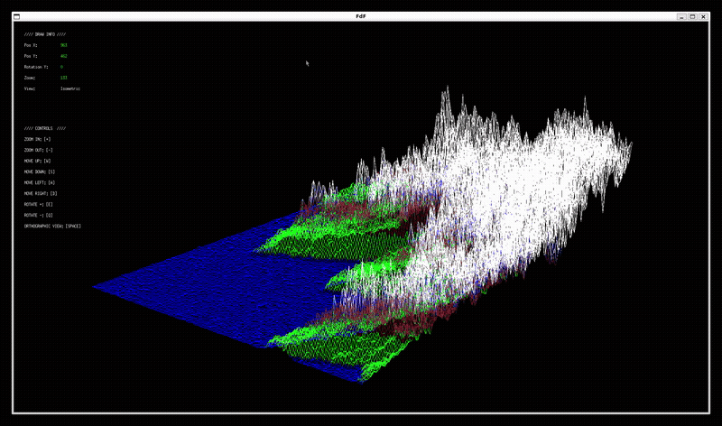

# FdF — Trigonometric 3D Wireframe Engine in C

<p align="center">
  
</p>

<p align="center">
  
  
  
  
</p>

---

## 📖 Overview
**FdF (Fil de Fer)** is a graphical 3D wireframe renderer developed in C. The program processes topographical landscape maps represented as two-dimensional coordinate grids with elevation values ($Z$) and converts them into interactive 3D graphical representations using trigonometric projection models.

Built using **MiniLibX** (the 42 School internal graphics library), this implementation features real-time interactive controls, dynamic camera positioning, dual projection rendering (Isometric and Orthographic), horizontal 3D mesh rotation, custom altitude modification, and custom hexadecimal color rendering.

---

## 📋 Technical Specifications & Key Features

*   **Applied Trigonometric Engine**: Vector transformation algorithms converting 3D grid space $(X, Y, Z)$ into 2D screen coordinates using custom trigonometric rotation matrices (yaw angle calculation via $\cos/\sin$ transformations) and isometric projection mapping.
*   **Projection Engines**: Dynamic switching between 3D **Isometric Projection** (30° tilt) and top-down **Orthographic View** using real-time coordinate transformations.
*   **3D Mesh Manipulation**: Real-time horizontal rotation around the map's centroid, adaptive zoom scaling tailored to grid dimensions, and interactive $Z$-altitude scaling.
*   **Memory Efficiency & Parsing Architecture**: Low-overhead parsing pipeline with strict $O(N)$ dynamic memory management, ensuring zero memory leaks during execution, continuous map loading, or termination.
*   **Bounding-Box Camera Containment**: Intelligent translation algorithms (panning) with adaptive step speed and boundary checks to prevent losing visual tracking of the rendered model.
*   **Color Parsing & Interpolation**: Native support for explicit hexadecimal color values embedded in map data (`0xFF0000`) with height-based color fallback logic.
*   **Performance Optimization**: Off-screen direct pixel buffering using MiniLibX raw memory pointers, writing pixels directly to the image buffer before pushing frames to avoid rendering flicker.

---

## 💻 MiniLibX & Subsystem Dependencies

This project relies on **MiniLibX**, an X11/AppKit wrapper library for low-level window management, pixel drawing, and event handling.

### System Requirements (Linux)

To compile and execute MiniLibX on Linux systems, the following X11 library dependencies are required:

```bash
sudo apt-get update
sudo apt-get install build-essential libx11-dev libxext-dev zlib1g-dev
```

---

## 🎮 Controls & Interface

| Key Binding | Action / Function |
| :--- | :--- |
| `W` / `A` / `S` / `D` | Translate / Pan camera view |
| `+` / `-` or Scroll | Dynamic Zoom In / Zoom Out |
| `Q` / `E` | Rotate map horizontally around central axis |
| `Z` / `X` | Increase / Decrease $Z$-altitude elevation |
| `SPACE` | Toggle between **Isometric** and **Orthographic** projections |
| `ESC` / `[X]` Click | Cleanly close window, free memory resources, and exit |

---

## 🛠️ Project Architecture

```text
.
├── libft/              # Custom C utility library for fundamental operations
├── mlx/                # MiniLibX graphical library for windowing and frame rendering
├── test_maps/          # Collection of .fdf topographical map files for testing
├── Makefile            # Automation build script for compilation and rules (including bonus)
└── src/                # Project source code directory
    ├── fdf.h           # Central header file containing data structures, macros, and prototypes
    ├── main.c          # Entry point, environment initialization, and event loop hook
    ├── map_info.c      # Trigonometric projections, point values initialization, and auto-centering
    ├── read_map.c      # File parser and reader converting .fdf maps into 2D memory arrays
    ├── print_pixels.c  # Bresenham line-drawing algorithm and direct pixel-to-image buffering
    ├── event_controller.c # Key event dispatchers for rotation, scale, altitude, and projection
    ├── menu.c          # On-screen dynamic HUD interface rendering live performance metrics
    ├── utils.c         # Hexadecimal color conversion, string tools, and map boundary calculations
    └── exit.c          # Clean termination procedures, window destruction, and memory cleanup
```

---

## 🚀 Compilation & Usage

### Compilation

The project includes a robust `Makefile` supporting standard targets. Compile the executable by running:

```bash
make
```

Additional `Makefile` rules:
*   `make bonus`: Compile the executable with bonus features.
*   `make clean`: Removes intermediate object files (`.o`).
*   `make fclean`: Removes object files and the final `fdf` binary executable.
*   `make re`: Recompiles the entire project from scratch.

### Program Execution

Pass any valid `.fdf` map file path as an argument to the compiled binary:

```bash
./fdf maps/42.fdf
```

To test with different terrain topologies provided in standard test suites:

```bash
./fdf maps/pyramide.fdf
./fdf maps/mars.fdf
```

---

<div align="center">
  <p>Developed as part of the 42 School Curriculum.</p>
</div>
