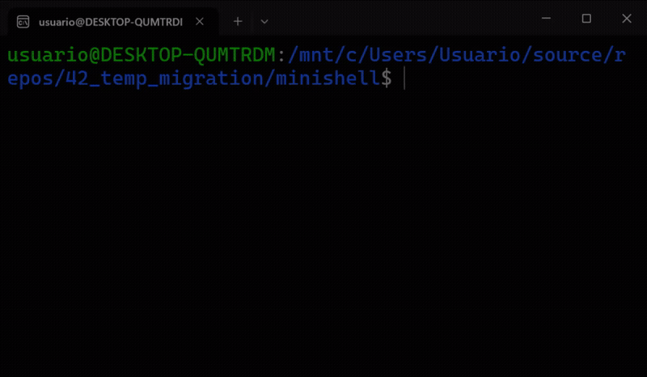
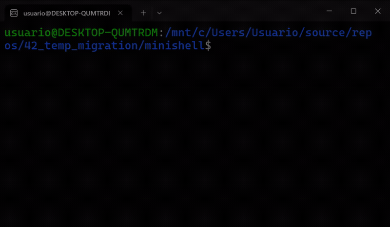

# Minishell — Custom Unix Shell Engine in C

<p align="center">
  
  
  
  
</p>

---

<table align="center">
  <tr>
    <td align="center" width="50%">
      <b>Advanced Custom Parser & Logic Chains</b><br />
      
    </td>
    <td align="center" width="50%">
      <b>Wildcard Expansions & Unix Signal Interceptions</b><br />
      
    </td>
  </tr>
</table>

---

## 📖 Overview
**Minishell** is a fully functional, miniature POSIX-compliant Unix command interpreter written in C. It replicates core Bash functionality including command line parsing, environment variable expansions, pipeline orchestration, multi-mode file redirections, heredocs, signal handling, and built-in commands.

This project goes deep into low-level systems programming, inter-process communication (IPC), process lifecycle management (`fork`, `execve`, `waitpid`), file descriptor manipulation (`pipe`, `dup2`), and terminal input/output control via `readline` and `termios`.

---

## 📋 Technical Specifications & Key Features

*   **Modular Architecture (Lexer, Parser, AST & Executor)**: Clear separation of concerns — tokenizing raw input strings into lexical units, parsing syntax, constructing abstract representation trees, and executing instructions sequentially or concurrently.
*   **Process Lifecycle & Pipeline Engine**: Concurrent pipeline execution (`cmd1 | cmd2 | ... | cmdN`) via `pipe()` and `dup2()` with total file descriptor leak prevention.
*   **Advanced Logic Operators & Parentheses (Bonus)**: Support for conditional boolean chains (`&&` and `||`) and nested subshell executions via recursive process branching `( command_list )`.
*   **Dynamic Wildcard Pattern Matching (Bonus)**: Native filesystem inspection engine expanding the `*` token into sorted matching directory files prior to command dispatch.
*   **Signal Handling & Terminal Control**: Asynchronous handling of `SIGINT` (Ctrl+C), `SIGQUIT` (Ctrl+\), and `EOF` (Ctrl+D) in interactive prompt vs. child process contexts without corrupting shell state.
*   **Built-in Command Suite**: Native C implementations of `echo` (with `-n`), `cd`, `pwd`, `export`, `unset`, `env`, and `exit` with precise POSIX return status codes.
*   **Environment & Variable Expansions**: Dynamic variable interpolation (`$VAR`, `$?`), quote management (preserving literals in `' '` vs expanding in `" "`), and custom environment tracking.

---

## 🛠️ Project Architecture

```text
.
├── Makefile                        # Compilation rules for the executable binary
├── inc/
│   └── minishell.h                 # Core header defining data structures, AST nodes, and prototypes
│
├── src/                            # Source code modularized by subsystem
│   ├── main/                       # Shell entry point, interactive REPL loop, and global state setup
│   ├── tokenizer/                  # Lexical analyzer breaking raw command strings into semantic tokens
│   ├── sectionizer/                # Syntactic parser building the AST and validating grammar rules
│   ├── expansion/                  # Environment variable ($VAR, $?) and quote stripping routines
│   ├── wildcard/                   # Directory scanner and pattern-matching engine for '*' tokens
│   ├── builtins/                   # Native C implementations of echo, cd, pwd, export, unset, env, exit
│   ├── execution/                  # Pipeline launcher, subshell branching, dup2 redirection, and waitpid
│   ├── files/                      # File descriptor handlers for input/output trunc, append, and heredocs
│   ├── signals/                    # Intercept handlers for SIGINT, SIGQUIT, and terminal attributes
│   ├── utils/                      # Memory collectors, string manipulations, and error printers
│   └── libft/                      # Extended custom C utility library
│
└── README_assets/                  # Visual assets, diagrams, and workflow animations for documentation
```

---

## 🧠 Key Engineering Challenges Solved

### 1. Lexical Analysis & Abstract Syntax Parsing
Handling nested quotes, unclosed syntax, and special metacharacters (`|`, `<`, `>`, `<<`, `>>`, `&&`, `||`, `(`, `)`) requires a robust Finite State Machine (FSM). The lexer breaks raw input strings into structured tokens, validating syntax grammar prior to execution to prevent execution-time crashes.

### 2. File Descriptor Multiplexing & Leak Prevention
Complex multi-stage pipelines demand surgical precision when closing file descriptors. Unclosed write ends in either parent or child processes prevent `EOF` signals from reaching downstream readers, causing pipeline hangs. The execution engine enforces strict FD tracking, ensuring every created pipe end is closed immediately after duplicated assignment (`dup2`).

### 3. Subshell Branching for Parentheses & Logic Chains
Conditional operators (`&&` / `||`) require evaluating the exact exit code of the preceding execution tree node. Parentheses enforce explicit priority by spawning isolated subshell child processes (`fork()`) that run nested execution loops and return their aggregated exit status to the parent orchestrator.

---

## 💻 Supported Features & Command Examples

```bash
# Environment Expansion & Quote Handling
echo "Logged in as $USER from home directory: $HOME"

# Pipelines & Redirections
cat < input.txt | grep -i "error" | sort | uniq > output_errors.txt

# Here-Document (Heredoc) with Delimiter
cat << EOF > log.txt
Line 1: System initialized
Line 2: Ready
EOF

# Logical Chains & Subshells (Bonus)
(ls -la && echo "List succeeded") || echo "List failed"

# Wildcard Expansion (Bonus)
ls *.c *.h
```

---

## 🚀 Compilation & Usage

### Build Rules

The project includes a Makefile with standard 42 rules:

*   `make`: Compiles the `minishell` executable.
*   `make bonus`: Compiles the `minishell` executable.
*   `make clean`: Removes object files (`.o`).
*   `make fclean`: Removes object files and binary executable.
*   `make re`: Recompiles the project from scratch.

### Launching the Shell

```bash
make
./minishell
```

> [!NOTE]
> **Memory Rigor & Valgrind Compliance**<br>
> Operating at the systems level, this shell ensures total memory stability. All dynamic allocations (`malloc`), environment duplications, and process memory maps are meticulously tracked and freed upon exit or execution errors.

---

<div align="center">
  <p>Developed as part of the 42 School Curriculum.</p>
</div>
