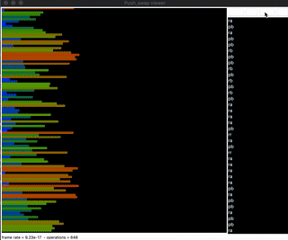

# push_swap — Because swap_push doesn't sound as good

<table align="center">
  <tr>
    <td align="center" width="100%">
    
     </td>
  </tr>
</table>

  <p align="center">
    
    
    
  </p>

---

## 📖 Overview

**Push_swap** is a key algorithmic project in the 42 curriculum that challenges you to solve a classic sorting problem under strict constraints regarding environment and performance:

* You have two stacks (`Stack A` and `Stack B`).
* Initially, `Stack A` contains an unsorted list of unique integers (both positive and negative) passed as arguments. `Stack B` is empty.
* The goal is to sort the numbers in `Stack A` in ascending order using only a restricted set of stack manipulation operations.
* The program must output the **smallest possible sequence** of instructions to standard output (`stdout`).

Additionally, the project includes a **`checker`** program (Bonus) that reads an instruction sequence from `stdin` and verifies if it successfully leaves the stack perfectly sorted.

---

## 🛠️ Available Instructions

| Instruction | Operation | Description |
| :---: | :---: | :--- |
| **`sa`** | *Swap A* | Swaps the first two elements at the top of `Stack A`. |
| **`sb`** | *Swap B* | Swaps the first two elements at the top of `Stack B`. |
| **`ss`** | *Swap Both* | Executes `sa` and `sb` simultaneously. |
| **`pa`** | *Push A* | Takes the top element from `Stack B` and places it on top of `Stack A`. |
| **`pb`** | *Push B* | Takes the top element from `Stack A` and places it on top of `Stack B`. |
| **`ra`** | *Rotate A* | Shifts up all elements of `Stack A` by 1. The first element becomes the last. |
| **`rb`** | *Rotate B* | Shifts up all elements of `Stack B` by 1. The first element becomes the last. |
| **`rr`** | *Rotate Both* | Executes `ra` and `rb` simultaneously. |
| **`rra`** | *Reverse Rotate A* | Shifts down all elements of `Stack A` by 1. The last element becomes the first. |
| **`rrb`** | *Reverse Rotate B* | Shifts down all elements of `Stack B` by 1. The last element becomes the first. |
| **`rrr`** | *Rev Rotate Both* | Executes `rra` and `rrb` simultaneously. |

---

## 🧠 Algorithm Breakdown (Cost Analysis / Mechanical Turk)

This project implements an optimized variation of the **Mechanical Turk / Cost-Based Greedy Algorithm**. Instead of attempting to sort elements directly within `A`, it pre-calculates the mechanical cost of pushing each number to its optimal position in `B`, iteratively choosing the "cheapest" node.

### 1. Normalized Indexing
Before moving any nodes, a bubble sort pass is performed on an auxiliary array to map every integer to its absolute rank ($0, 1, 2, \dots, N-1$). This simplifies relative comparison logic and eliminates edge cases caused by large integers or negative numbers.

### 2. Strategic Emptying to Stack B (`push_stack` & `preview_moves`)
* If $N \le 3$, the stack is solved in 1 or 2 moves using hardcoded conditional logic (`sort_last_three`).
* If $N > 3$, the first two elements are pushed to `Stack B` to initialize the supporting stack.
* While `Stack A` contains more than 3 elements:
  1. **Cost Calculation (`preview_moves`):** For each node in `A`, it measures the required rotations in `A` and the target insertion index in `B` (`search_previous_position`).
  2. **Double Rotation Optimization (`move_stacks`):** If both target positions require moving in the same direction (both upwards or both downwards), the algorithm uses dual operations like `rr` or `rrr` to cut rotation cost in half.
  3. **Greedy Selection (`get_cheap_idx`):** Executes the move requiring the lowest total amount of operations and performs `pb`.

### 3. Base Sorting of the Remaining 3 Elements
When only 3 nodes remain in `Stack A`, they are sorted in-place using deterministic combinations of `ra`, `sa`, and `rra` (`sort_last_three`).

### 4. Clean Re-insertion into Stack A (`get_all_stack_b`)
Once the base trio in `A` is sorted, the algorithm pushes elements back from `B` to `A` while ensuring proper alignment through targeted reverse rotations (`rra`).

---

## 🚀 Compilation and Usage

To compile the mandatory part:
```bash
make
```

To compile including the bonus features:
```bash
make bonus
```

To strip down and clear all middle object files (.o) generated during build operations:
```bash
make clean
```

To clean out both intermediate object files and the resulting static archive file:
```bash
make fclean
```

To perform a complete project cleanup and rebuild all modules from the ground up:
```bash
make re
```

---

### Execution Examples

#### Push_swap
Run the program by passing a space-separated sequence of unsorted integers:

```bash
./push_swap 4 67 3 1 23
```

Expected output (sequence of operations):
```bash
pb
pb
sa
rra
pa
pa
```

To count the total number of instructions generated:
```bash
./push_swap 4 67 3 1 23 | wc -l
```

#### Checker (Bonus)
The `checker` executable validates whether the sequence generated by `push_swap` successfully sorts the numbers:

```bash
ARG="4 67 3 1 23"; ./push_swap $ARG | ./checker $ARG
```

Output when correctly sorted:
```bash
OK
```

If the sequence fails to sort the stack:
```bash
KO
```

---

## 🛡️ Error Handling

The program strictly validates input arguments. If an anomaly is detected, it writes `Error\n` to standard error (`stderr` / `fd 2`) and gracefully exits while freeing all allocated memory without leaks:

* Non-numeric input (e.g., `abc`, `21b`).
* Numbers out of the 32-bit signed integer range (`INT_MAX` / `INT_MIN`).
* Duplicate numbers in the arguments.
* If the input list is already sorted, the program exits immediately without printing any operations.

---

<div align="center">
  <p>Developed as part of the 42 School Curriculum.</p>
</div>
